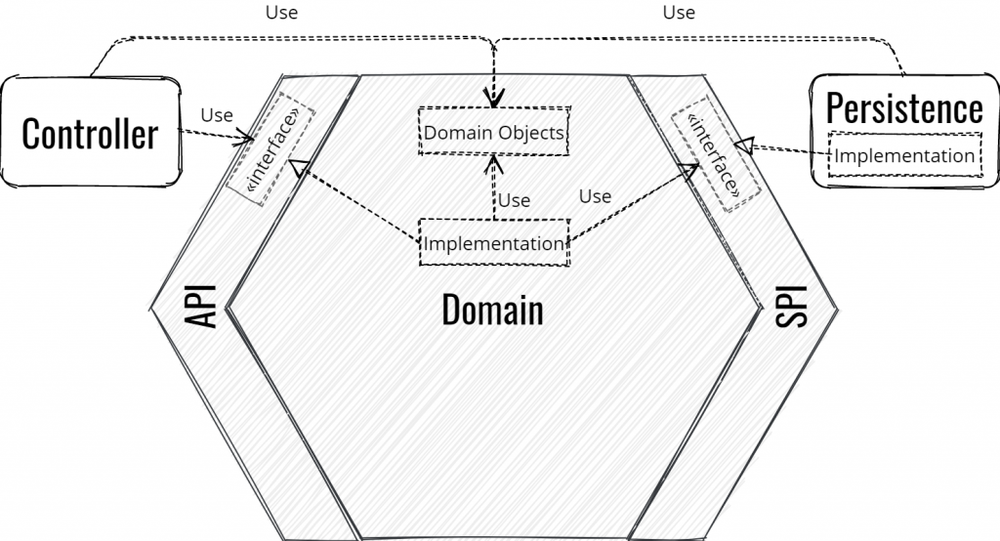

tournament-api
==================

A project implemented with hexagonal architecture.

For the left side : 
- Dropwizard for rest api

For the right side :
-  DynamoDB for persistence

For UI :
- Angular

Use Localstack to use a local AWS cloud stack.

## Hexagonal architecture


```bash
├── domain
│   ├─── src
│   │     ├── ports
│   │     │    ├─── api
│   │     │    └─── spi
│   │     └── features
│   ├── build.gradle
├── application
│   ├─── rest
│   │   └── src
│   ├─── ui
│   │   └── src
│   └── build.gradle
├── infrastructure
│   ├── repository
│   │   ├── inmemory
│   │   │   └── src
│   │   ├── dynamodb
│   │   │    └── src
│   └── build.gradle
├── launcher
│   ├── build.gradle
│   └── src
```
**Domain** has no framework, it allows to reuse the business domain independently of the change of the technical stack.

**Application** is the left side of the hexagon. it contains all implementations to call the **Domain**.

**Infrastructure** is the right side of the hexagon. It contains all implementation to retrieve informations from third parties.

## Requirements

* Docker

## How to use it
Run the following command in terminal :
```bash
./start.sh
```

Go to http://locahost:4200 to play with the app

Improvements
------------
* Use AWS Lambda to trigger Delete Players feature
* Use Swagger to document the Rest API
* Rewrite all frontend in TDD
* Use Cypress to implement e2e tests
* Move gradle clean build step to docker-compose 
* Move ui project to an independent subproject
